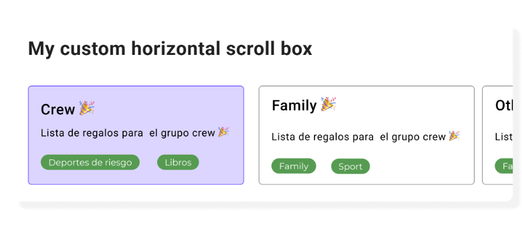
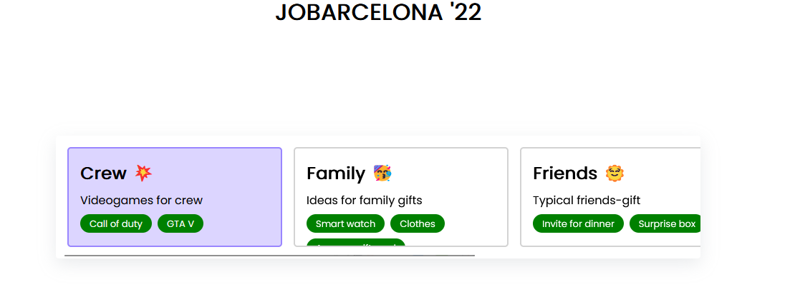

# JOBarcelona '22 | Gift list Front-end

> This project was realized for the JOBarcelona '22 Hackaton front-end category.
> Consists of allowing its users to create gift lists and customize them.

It basically render a ScrollBox with many cards inside of it, with horizontal scroller in PC resolution, but in Mobile resolution the scroll changes to vertically.

### Proposed challenge



### Final result




### Deploy in Vercel

https://jobarcelona-22-front-end.vercel.app/


## Atomic design

This project was done using an atomic design, which components folder have specific structure:

    .
    ├── components                  # This folder stores all the components.
    │   ├── atoms                   # Small components, like tags, title or descriptions
    │   ├── molecules               # Containers or wrappers, in this case will be the card component.
    │   └── organism                # These components are sections of the page , in this case will be the ScrollBox
    └── ...

### Atoms

- Title: Title of gift card, the html tag selected was &lt;h2&gt;
- Description: Description of gift card, the html tag selected was &lt;p&gt;
- Tags: The tags of a gift card, with flex display, the html tag selected was &lt;span&gt;

> all of these atoms only have the children prop.

### Molecules

- Card: Card will contain all the atoms described, which are include in props too, the html tag selected was &lt;article&gt;

> Card Tag props will only accept an array of strings, the array will be iterate to render the tags with the given strings

### Organism

- ScrollBox: The scrollBox would render only cards, the html tag selected was &lt;section&gt;

### Semantic HTML

The final semantic html structure is:

```shell
<section>
    <article>
        <h2>Title</h2>
        <p>Description</p>
        <span>Tag1<span>
    </article>
</section>
```

## Languages and tools

<div>


</div>
<br/>

- React: I used this framework because im studying it, and i want to perform my knowledge (done with create-react-app)
- Typescript: With React, I used Typescript to do the components more stricted.
- StoryBook: To documentate the components I've used Story book. It's a library where you can see your components and test it.
- CSS: In style case, I've used CSS, the reason to not use SASS is about there are only few components, and this components don't require too many stylish.

## Installation

How to install the project

> This project dependencies were installed with npm

```shell
    # Clone repository
    git clone https://github.com/LuisMM24/jobarcelona-22-front-end

    # install dependencies
    npm install
```

Script commands

```shell
    # run
    npm run start
    # test command
    npm run test
    # run storybook documentation
    npm run storybook
```

## License

[MIT](https://opensource.org/licenses/MIT)
